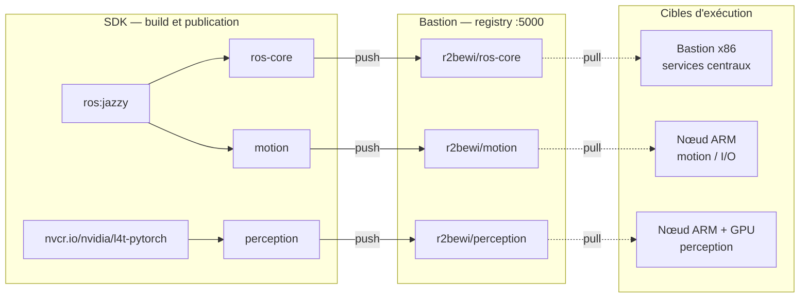
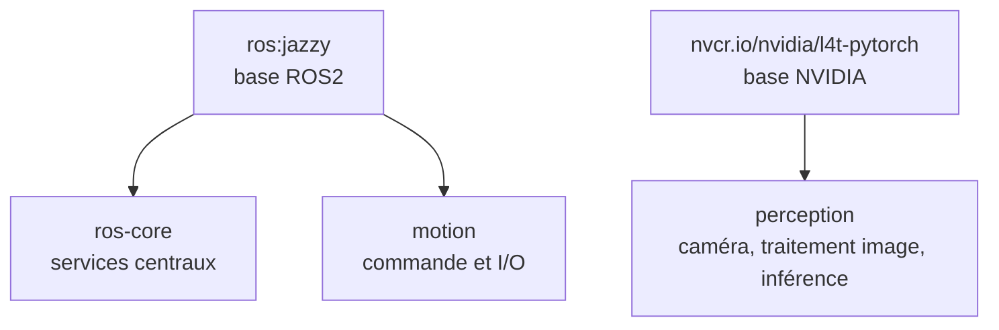

# containers — Images Docker des services R2BEWI

Ce module construit, tague et publie les images Docker utilisées par les services R2BEWI. Les images produites sont poussées sur le registry du bastion, puis récupérées par les nœuds du réseau.

## Rôle dans le SDK

Les nœuds R2BEWI exécutent leurs services dans des conteneurs. Ce module fournit la chaîne de build associée :

* construction des images ;
* organisation des images par rôle d'exécution ;
* publication sur le registry privé du bastion ;
* mise à disposition d'une source unique pour le déploiement.

L'architecture cible repose sur trois classes d'exécution :

* un **bastion x86** pour les services centraux et la distribution ;
* un nœud **ARM** pour le mouvement et les interfaces matérielles ;
* un nœud **ARM + GPU** pour la vision, la perception et l'inférence.

Le bastion joue ici un double rôle : **point central de distribution** des images et **support d'exécution** pour les services ROS2 communs.



## Structure du module

```text
containers/
├── docker/                       ← environnement de build
├── src/
│   ├── ros-core/Dockerfile       ← services ROS2 centraux
│   ├── motion/Dockerfile         ← commande moteur / interfaces matérielles
│   └── perception/Dockerfile     ← vision + inférence
└── Makefile
```

## Prérequis

* bastion démarré avec le registry Docker actif (`registry.r2bewi.internal:5000`) ;
* connectivité réseau entre la machine de développement et le bastion.

### Prérequis supplémentaires pour le build ARM64

**1. QEMU — émulation ARM64 sur x86 (une seule fois par machine)**

```bash
docker run --rm --privileged multiarch/qemu-user-static --reset -p yes
```

Permet à Docker buildx de construire des images `linux/arm64` sur une machine x86.
Persistant jusqu'au prochain reboot ; à relancer si la machine a redémarré.

**2. Registry insecure dans le daemon Docker**

Le registry du bastion tourne en HTTP. Ajouter dans `/etc/docker/daemon.json` :

```json
{
  "insecure-registries": ["registry.r2bewi.internal:5000"]
}
```

Puis redémarrer le daemon :

```bash
sudo systemctl restart docker
```

## Commandes

```bash
# Construire le container de build
make docker-build

# Construire toutes les images (x86)
make build

# Publier les images sur le registry du bastion
make push

# Construire et publier avec un tag spécifique
make build push IMAGE_TAG=v1.2.0

# Utiliser un autre registry
make build push REGISTRY_HOST=192.168.1.10 REGISTRY_PORT=5000

# Supprimer les images locales
make clean

# Ouvrir un shell dans le container de build
make shell
```

### Commandes ARM64

```bash
# Créer le builder buildx avec support registry HTTP (une seule fois)
make buildx-setup

# Build et push ros-core en linux/arm64
make build-arm64

# Build un autre service ou un autre tag
make build-arm64 ARM64_SVC=motion IMAGE_TAG=v1.0.0

# Déployer le Job de test sur le cluster K3s et afficher les logs
make deploy-test

# Afficher les logs du Job de test
make logs-test

# Supprimer le Job de test du cluster
make clean-test
```

## Images produites

Les images sont publiées sous la forme :

```text
<REGISTRY_HOST>:<REGISTRY_PORT>/r2bewi/<service>:<IMAGE_TAG>
```

| Image        | Base                         | Cible       | Description                                                             |
| ------------ | ---------------------------- | ----------- | ----------------------------------------------------------------------- |
| `ros-core`   | `ros:jazzy`                  | Bastion x86 | Services ROS2 centraux et socle commun                                  |
| `motion`     | `ros:jazzy`                  | ARM         | Commande moteur, actionneurs et interfaces matérielles                  |
| `perception` | `nvcr.io/nvidia/l4t-pytorch` | ARM + GPU   | Acquisition caméra, traitement image, inférence GPU et publication ROS2 |

Les images ne partagent pas toutes la même base ni la même contrainte système. Les services CPU génériques s'appuient sur une base ROS2 classique, tandis que l'image `perception` suit la pile NVIDIA spécifique aux plateformes ARM accélérées par GPU.

> **Note compatibilité**
> La chaîne de perception s'appuie sur une base dédiée afin de conserver l'accès aux bibliothèques matérielles et à l'environnement d'exécution GPU. Elle n'est donc pas alignée sur la même base système que les services ROS2 génériques.

## Déploiement sur les nœuds

Le déploiement est piloté par **K3s**. Les nœuds récupèrent leurs images depuis le registry du bastion, configuré comme miroir dans `registries.yaml` (généré par `r2bewi init`).

Le registry du bastion est utilisé en HTTP sur le réseau interne. Il est déclaré comme registry non sécurisé dans la configuration containerd de chaque nœud via `registries.yaml` :

```yaml
mirrors:
  "registry.r2bewi.internal:5000":
    endpoint:
      - "http://registry.r2bewi.internal:5000"
```

Les manifests K3s (déposés dans `/var/lib/rancher/k3s/server/manifests/r2bewi/`) référencent les images sous la forme `registry.r2bewi.internal:5000/r2bewi/<service>:<tag>`. K3s se charge de les tirer et de les exécuter sur les bons nœuds selon les sélecteurs de nœud définis dans les manifests.

## Hiérarchie des images



## Cycle de mise à jour

```text
make build   → reconstruit les images
make push    → publie les nouvelles versions sur le registry du bastion
déploiement  → les nœuds récupèrent les images mises à jour via K3s (containerd pull depuis le registry du bastion)
```

## Tests

```bash
make test
```

Les tests s'exécutent dans le container Docker du module (`r2bewi-containers-build`). `hadolint` est disponible dans cet environnement.

### Couverture

| Étape | Ce qui est vérifié |
|---|---|
| Présence | chaque service déclaré dans `SERVICES` dispose d'un `Dockerfile` |
| `hadolint` | bonnes pratiques Docker et règles shellcheck intégrées sur chaque Dockerfile |

Les services vérifiés sont : `ros-core`, `motion`, `perception`.

### Structure

```text
containers/src/tests/
└── lint.sh          ← vérification de présence + hadolint
containers/src/
└── .hadolint.yaml   ← configuration des règles ignorées
```

### Règles hadolint ajustées

| Règle | Raison |
|---|---|
| `DL3008` | versions apt non épinglées — les paquets `ros-jazzy-*` n'ont pas de schéma de version stable à épingler |
| `DL3013` | versions pip non épinglées — `onnxruntime-gpu` et `numpy` sont contraints par la chaîne JetPack |
| `SC1091` | `source /opt/ros/jazzy/setup.bash` est valide à l'exécution mais inaccessible lors de l'analyse statique |

## Positionnement

Ce module ne porte pas à lui seul l'ensemble du déploiement des nœuds. Son rôle est plus circonscrit : produire et distribuer des images cohérentes, versionnées et adaptées aux différentes classes d'exécution du système R2BEWI.

Le choix d'un conteneur **`perception`** unique pour la chaîne vision + inférence évite de scinder artificiellement un pipeline fortement couplé. L'acquisition, le traitement image et l'inférence restent ainsi regroupés sur la même cible d'exécution, au plus près des accélérateurs disponibles.
