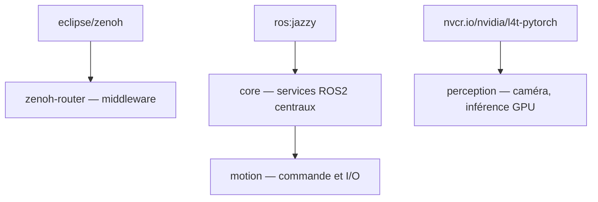

# docker — Images et environnement de build

Ce module construit, tague et publie les images Docker utilisées par les services R2BEWI, et fournit l'environnement de build conteneurisé du SDK.

## Structure

```text
docker/
├── core/
│   ├── buildkit/          ← configuration BuildKit (builder ARM64)
│   └── sdk/               ← environnement de build SDK (Ubuntu 24.04)
├── ros/
│   ├── core/Dockerfile    ← services ROS2 centraux
│   ├── motion/Dockerfile  ← commande moteur / interfaces matérielles
│   └── perception/        ← vision + inférence GPU
├── .hadolint.yaml         ← règles hadolint
├── lint.sh                ← vérification présence + analyse hadolint
└── Makefile
```

## Images produites

| Image | Base | Cible | Description |
|---|---|---|---|
| `zenoh-router` | `eclipse/zenoh` | Bastion x86 | Router Zenoh — point central du middleware ROS2 |
| `core` | `ros:jazzy` | Bastion x86 | Services ROS2 centraux et socle commun |
| `motion` | `r2bewi/core` | ARM | Commande moteur, actionneurs et interfaces matérielles |
| `perception` | `nvcr.io/nvidia/l4t-pytorch` | ARM + GPU | Acquisition caméra, traitement image, inférence GPU |

Les images sont publiées sous la forme :

```text
<REGISTRY_HOST>:<REGISTRY_PORT>/r2bewi/<service>:<IMAGE_TAG>
```



## Prérequis

### Build ARM64

**QEMU — une seule fois par machine :**

```bash
docker run --rm --privileged multiarch/qemu-user-static --reset -p yes
```

**Registry insecure dans `/etc/docker/daemon.json` :**

```json
{ "insecure-registries": ["registry.r2bewi.internal:5000"] }
```

```bash
sudo systemctl restart docker
```

## Commandes

```bash
# Environnement de build SDK
make -C docker build-env
make -C docker shell

# Images ROS2 (x86)
make -C docker build
make -C docker push
make -C docker build push IMAGE_TAG=v1.2.0

# ARM64 (VPN requis)
make -C docker buildx-setup       # une seule fois
make -C docker build-arm64
make -C docker build-arm64 ARM64_SVC=motion IMAGE_TAG=v1.0.0

# Lint Dockerfiles
make -C docker test

# Nettoyage
make -C docker clean
```

## Tests — hadolint

```bash
make -C docker test
```

| Étape | Ce qui est vérifié |
|---|---|
| Présence | chaque service déclaré dispose d'un `Dockerfile` |
| `hadolint` | bonnes pratiques Docker + règles shellcheck intégrées |

### Règles ajustées

| Règle | Raison |
|---|---|
| `DL3008` | versions apt non épinglées — paquets `ros-jazzy-*` sans schéma de version stable |
| `DL3013` | versions pip non épinglées — `onnxruntime-gpu` contraint par la chaîne JetPack |
| `SC1091` | `source /opt/ros/jazzy/setup.bash` inaccessible lors de l'analyse statique |
